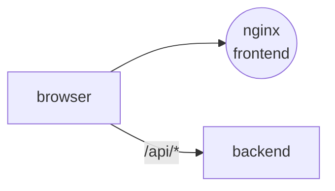

<div align="center">

<a href="https://gitlab.com/digital-barometer"></a>

# 📊 frontend

### Dashboard: pick a topic, a period and sources — get the barometer, emotions, trends and mentions

[](https://gitlab.com/digital-barometer/frontend/-/pipelines)


<sub>Part of <a href="https://gitlab.com/digital-barometer"><b>Digital Barometer</b></a> — media monitoring with an LLM sentiment barometer</sub>

</div>

---

## Role in the system

A single-page dashboard on top of the [backend](https://gitlab.com/digital-barometer/backend). The user
picks a topic, a date range and sources, starts an analysis and gets the results on one screen. The API is
expected on the same domain under `/api`: the Vite dev server proxies it locally, and a reverse proxy does
it in production.



## Features

- **Analysis setup** — topic picker with keyword editing and new topic creation, date range picker, multi-select of sources.
- **Barometer** — 0–100 gauge with the sentiment label for the run.
- **Charts** — emotion distribution, sentiment by day, mentions over time, Google Trends search interest.
- **Insights and mentions** — LLM-generated insights and the list of collected mentions with links to the originals.
- **Light / dark theme** toggle.

## Contracts

| Direction | Channel | Name |
| --- | --- | --- |
| ➡️ Out | HTTP | `GET /sources` · `GET` / `POST /topics` · `PATCH /topics/{id}` |
| ➡️ Out | HTTP | `POST /analysis` · `GET /analysis/{id}` · `GET /analysis/{id}/charts` |

| Variable | Default | Purpose |
| --- | --- | --- |
| `VITE_API_URL` | `/api` | API base URL baked into the build |
| `VITE_API_PROXY_TARGET` | `http://localhost:8000` | where the Vite dev server proxies `/api` |
| `WEB_PUBLIC_HOST` | — | Traefik host rule (compose) |
| `WEB_PORT` | `8081` | published port (compose) |

## Quick start

**With Traefik** — needs `web_network` and Traefik from [infra](https://gitlab.com/digital-barometer/infra):

```bash
cp .env.example .env    # WEB_PUBLIC_HOST, VITE_API_URL
DOCKER_IMAGE_NAME=barometer-web docker compose up -d --build   # http://localhost:8081, https://$WEB_PUBLIC_HOST
```

**Local development:**

```bash
cp .env.example .env
npm install
npm run dev          # http://localhost:5173, /api → VITE_API_PROXY_TARGET
npm run typecheck
npm run build
```

## Structure

```text
frontend/
├── nginx.conf               # SPA fallback, /healthz, asset caching, security headers
└── src/
    ├── api/                 # axios client: topics, sources, analysis
    ├── components/
    │   ├── charts/          # BarometerGauge, EmotionsDonut, MentionsLineChart, TrendLineChart, EngagementBarChart
    │   ├── forms/           # TopicPicker, DateRangePicker, SourcesMultiSelect
    │   └── ui/              # Button, Card, Input, Checkbox, Tag
    ├── features/dashboard/  # DashboardPage, insights, mentions list and stats
    ├── hooks/               # useAnalysisRun, useTheme
    └── utils/
```
