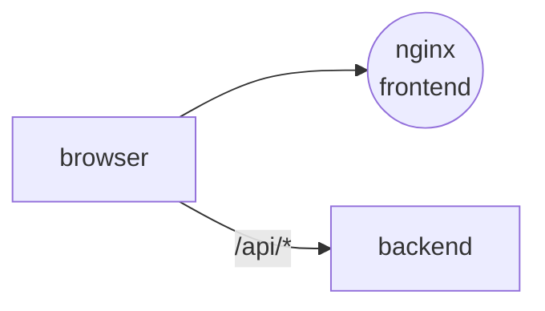

# Digital Barometer Frontend

Pick a topic, a period, and sources — get the barometer, emotions, trends, and mentions.

Stack: React 18, TypeScript, Vite, Tailwind CSS, Recharts, nginx.

## Role in the system

A one-page dashboard for the `backend`.
You pick a topic, dates, and sources, run the analysis, and see everything on one
screen. The API is expected at `/api` on the same domain: Vite proxies it in
development, a reverse proxy does it in production.



## Features

- **Analysis setup** — pick or create a topic, edit keywords, choose dates and sources.
- **Barometer** — a 0–100 gauge with a sentiment label.
- **Charts** — emotions, sentiment by day, mentions over time, Google Trends interest.
- **Insights and mentions** — LLM insights and the mentions with links to the originals.
- **Light and dark theme.**

## Contracts

| Direction | Channel | Name |
| --- | --- | --- |
| Out | HTTP | `GET /sources` · `GET` / `POST /topics` · `PATCH /topics/{id}` |
| Out | HTTP | `POST /analysis` · `GET /analysis/{id}` · `GET /analysis/{id}/charts` |

## Quick start

With Docker and Traefik (needs `web_network` and Traefik from
`infra`):

```bash
cp .env.example .env    # WEB_PUBLIC_HOST, VITE_API_URL
DOCKER_IMAGE_NAME=barometer-web docker compose up -d --build   # http://localhost:8081
```

For development:

```bash
cp .env.example .env
npm install
npm run dev          # http://localhost:5173
npm run typecheck
npm run build
```

## Structure

```text
frontend/
├── nginx.conf               # SPA fallback, /healthz, caching, security headers
└── src/
    ├── api/                 # API client
    ├── components/
    │   ├── charts/          # BarometerGauge, EmotionsDonut, MentionsLineChart, TrendLineChart, EngagementBarChart
    │   ├── forms/           # TopicPicker, DateRangePicker, SourcesMultiSelect
    │   └── ui/              # Button, Card, Input, Checkbox, Tag
    ├── features/dashboard/  # dashboard page, insights, mentions
    ├── hooks/               # useAnalysisRun, useTheme
    └── utils/
```
